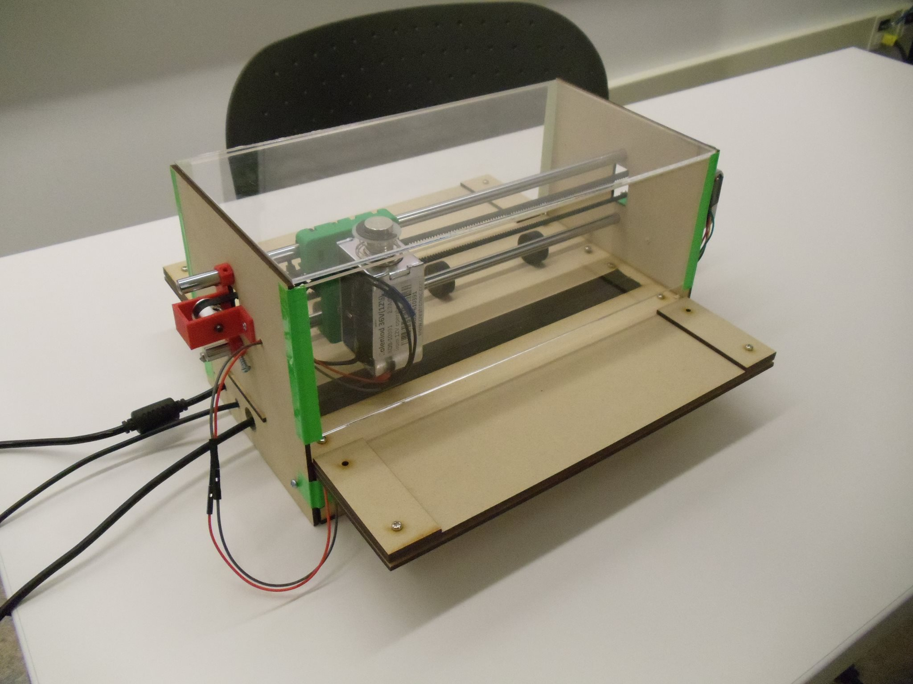

BraillePrinter
==============

Moving away from Java to Python and continuing braille printer project
This is the first iteration of the conversion software from English to Braille cell representation
Then from Braille Cell Representation into instructions

See Braille Printer Video.mp4 for a demonstration video
